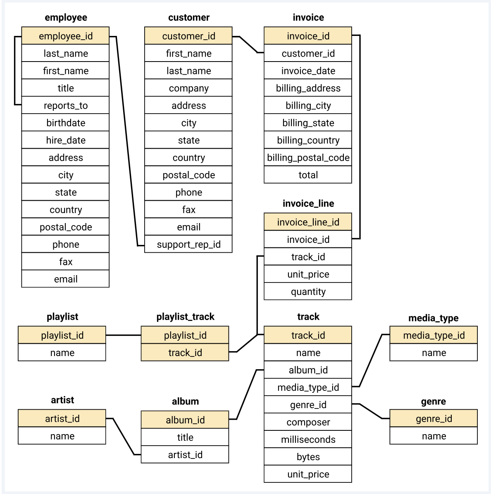
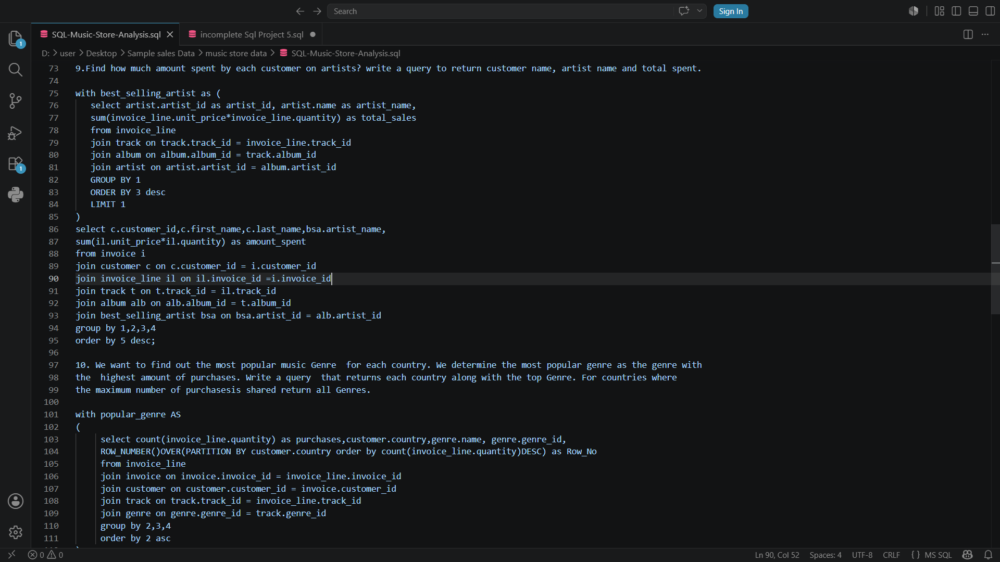

# 🎵 SQL Music Store Analysis

## 📌 Project Overview

This project analyzes a Music Store database using SQL to solve real-world business problems. The analysis covers customer behavior, sales trends, artist performance, genre popularity, and revenue insights.

The project was completed using PostgreSQL and contains solutions to 11 business questions ranging from basic SQL queries to advanced Common Table Expressions (CTEs), aggregations, joins, and ranking functions.

---

## 🛠️ Tools Used

- PostgreSQL
- pgAdmin 4
- VS Code
- GitHub

---

## 📂 Database Tables

The database contains the following tables:

- Employee
- Customer
- Invoice
- Invoice_Line
- Track
- Album
- Artist
- Genre
- Media_Type
- Playlist
- Playlist_Track

---

# 🗺️ Database ER Diagram

---

# 💻 Query Preview

The SQL queries used for solving business questions are stored in:

📄 **SQL-Music-Store-Analysis.sql**

Example query screenshot:

---

# 📊 Query Result Preview

Sample query execution and result output:

---

# 📈 Business Questions Solved

### Easy Level

1. Who is the senior most employee based on job title?
2. Which countries have the most invoices?
3. What are the top 3 invoice totals?
4. Which city has generated the highest revenue?
5. Who is the best customer?

### Moderate Level

6. Find all Rock Music listeners.
7. Invite the artists who have written the most Rock music.
8. Return all tracks longer than the average song length.

### Advanced Level

9. Find how much amount spent by each customer on artists.
10. Find the most popular music Genre for each country.
11. Determine the customer that has spent the most on music for each country.

---

# 🔍 SQL Concepts Used

- SELECT
- WHERE
- ORDER BY
- GROUP BY
- HAVING
- INNER JOIN
- Common Table Expressions (CTEs)
- Aggregate Functions
- Window Functions
- Subqueries
- Ranking Functions

---

# 🎯 Key Insights

- Identified the highest revenue-generating countries and cities.
- Determined top-spending customers across countries.
- Analyzed customer purchase behavior.
- Discovered the most popular genres by country.
- Evaluated artist performance based on sales.
- Used advanced SQL techniques to solve business problems.

---

## 👨‍💻 Author

**Babloo Kumar**

📧 bablookumarroy839@gmail.com

🔗 LinkedIn: https://www.linkedin.com/in/babloo-kumar-roy-8793982b5

---

⭐ If you found this project useful, feel free to star the repository.
